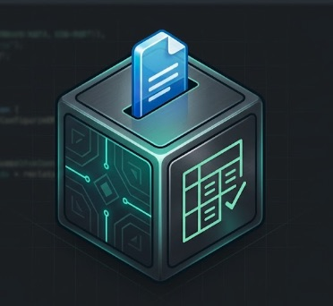

<p align="center">
  
</p>

# OPLedger

**Self-hosted, open source bookkeeping for people who just need clean books.**

OPLedger is a containerized web app that turns the QFX files your bank already generates into a real accounting ledger -- categorized, tagged, and Schedule C-ready. No subscription. No account creation with a third party. No bank credentials handed to anyone. Just your data, running on your machine, accessible in a browser.

---

## The problem

If you run a single-member LLC with a handful of recurring expenses and mixed personal/business spend across one or two accounts, you do not need enterprise accounting software. You need a clean way to tag transactions, generate a P&L, and produce something your tax software can import once a year.

OPLedger does exactly that -- locally, privately, and without a monthly fee.

---

## How it works

Every major U.S. financial institution supports QFX export from their online banking portal. QFX is an open standard (built on OFX) that has been available since 1997. It requires no third-party aggregator, no credential sharing, and no ongoing connection. You download the file. You drop it in. OPLedger does the rest.

```
Bank portal  -->  Export QFX  -->  Drop into OPLedger  -->  Tag  -->  Report  -->  Tax export
```

No aggregator tokens. No OAuth flows. No recurring sync connection to break at the worst possible moment.

---

## Features

- Import QFX files from any compliant financial institution
- Multi-user with role-based access (Owner, Bookkeeper, Viewer)
- Tag transactions as business or personal
- Assign Schedule C categories to business transactions
- Auto-categorization that learns from your tagging history
- Multi-account support (e.g. credit card + checking in one ledger)
- Deduplication across overlapping export windows
- P&L report by time period
- Schedule C summary
- TXF export for tax software import
- Full CSV export
- PDF report generation
- AES-256 encryption at rest via SQLCipher
- Passphrase-derived encryption key, set on first run
- JWT-based session auth with configurable timeout
- Fully responsive -- works in any browser on any screen size
- No telemetry, no cloud sync, no external dependencies at runtime

---

## Installation

OPLedger runs as a Podman container. Podman is a daemonless, rootless, Docker-compatible container runtime with no licensing restrictions. The installer handles it automatically.

### macOS

```bash
brew tap opledger/opledger
brew install opledger
```

This installs Podman if not already present, pulls the OPLedger container image, and adds OPLedger to your Applications folder. Double-click to launch.

### Windows

```powershell
scoop bucket add opledger https://github.com/opledger/scoop-bucket
scoop install opledger
```

This installs Podman, pulls the container image, and adds OPLedger to your Start Menu. Click to launch.

### Linux

```bash
curl -fsSL https://get.opledger.app/install.sh | bash
```

Installs Podman, pulls the image, and registers a `.desktop` launcher in your application grid.

### Manual (any platform with Podman installed)

```bash
podman-compose -f https://raw.githubusercontent.com/opledger/opledger/main/compose.yaml up -d
```

Then open `http://localhost:8080` in your browser.

---

## First run

On first launch, OPLedger walks you through a short setup:

1. Set your Owner username and password
2. Set your encryption passphrase (used to derive the database encryption key -- store this somewhere safe)
3. Name your ledger (e.g. your LLC name)
4. Add your first account

After setup, the app is ready to import transactions. Additional users can be added from the Admin panel at any time.

---

## User roles

| Role | Permissions |
|---|---|
| Owner | Full access including user management, settings, and data export |
| Bookkeeper | Import transactions, tag, categorize, and view reports |
| Viewer | Read-only access to reports and P&L |

OPLedger supports multiple users on a single instance, making it suitable for self-hosters who want to share access with a bookkeeper or accountant without sharing credentials.

---

## Importing transactions

### Step 1 -- Export QFX from your bank

Each institution labels this slightly differently:

| Institution | Where to find it |
|---|---|
| Chase | Account activity > Download > File type: Quicken |
| USAA | Transactions > Export > Quicken (QFX) |
| American Express | Statements & Activity > Export > Quicken |
| Bank of America | Download Transactions > Quicken Web Connect |
| Wells Fargo | Download Transactions > Quicken (QFX) |

Download a date range. Overlap is fine -- OPLedger deduplicates on transaction ID.

### Step 2 -- Import

Drag and drop the QFX file into the import panel, or use the file picker. Multiple files and multiple accounts can be imported in the same session.

### Step 3 -- Tag

Each transaction gets a toggle: Personal or Business. Business transactions get a Schedule C category. OPLedger remembers your choices -- the next time it sees a transaction from the same payee, it suggests the same tag automatically.

---

## Schedule C categories

OPLedger maps to standard IRS Schedule C line items:

- Advertising
- Car and truck expenses
- Commissions and fees
- Contract labor
- Depreciation
- Insurance
- Legal and professional services
- Office expenses
- Rent or lease (equipment)
- Repairs and maintenance
- Supplies
- Taxes and licenses
- Travel
- Utilities
- Wages
- Other expenses (with memo field)

Custom categories can be added in `config/categories.yaml`.

---

## Export and tax software

OPLedger exports in three formats:

- **TXF** -- imports directly into TurboTax Home & Business, TurboTax Self-Employed, and most desktop tax software that accepts TXF for Schedule C
- **CSV** -- for manual review or handoff to a CPA
- **PDF** -- formatted P&L and Schedule C summary suitable for records or filing support

---

## Security and encryption

OPLedger is designed for users who take data seriously.

- **AES-256 encryption at rest** via SQLCipher. The database is encrypted on disk. If the container volume is accessed directly, the data is unreadable without the passphrase.
- **Passphrase-derived key** using PBKDF2. Your passphrase is never stored. The derived key unlocks the database at runtime and exists only in memory.
- **Bcrypt password hashing** for all user accounts.
- **JWT session tokens** with configurable expiration. Default is 8 hours. Can be set to a longer window for local single-user installs or tightened for shared deployments.
- **HTTPS-ready** -- place a reverse proxy (Caddy, Nginx) in front for TLS termination when exposing beyond localhost.
- **No telemetry** of any kind. No analytics, no error reporting to external services, no usage tracking.

---

## Configuration

On first run, OPLedger creates a `config/` directory in your data volume:

```
config/
  categories.yaml       # Schedule C category definitions
  payee_rules.yaml      # Auto-tagging rules by payee name pattern
  accounts.yaml         # Account nicknames and metadata
  settings.yaml         # Session timeout, locale, fiscal year start
```

All configuration is plain text. No proprietary formats.

---

## Architecture

OPLedger is a single Podman image containing:

- **FastAPI** backend -- QFX parsing, ledger logic, REST API
- **SQLite via SQLCipher** -- encrypted local persistence
- **Vanilla JS frontend** -- no framework dependency, fully responsive
- **Podman** -- daemonless container runtime, no Docker Desktop required

The frontend communicates with the backend exclusively through the REST API. This is the same API a cloud deployment would expose -- no localhost assumptions are baked into the client.

The compose YAML is the single source of truth for the deployment. It translates directly to a Kubernetes manifest, a Fly.io deployment, or a Render service with minimal modification.

### Platform launchers

OPLedger installs a lightweight native launcher on each platform:

| Platform | Launcher type | What it does |
|---|---|---|
| macOS | `.app` bundle in `/Applications` | Runs `podman-compose up -d`, opens `http://localhost:8080` |
| Windows | `.lnk` shortcut in Start Menu | Runs PowerShell wrapper, opens `http://localhost:8080` |
| Linux | `.desktop` file in application grid | Runs shell script, opens `http://localhost:8080` via `xdg-open` |

No Electron. No Tauri. No native framework. The app is a container and a shortcut.

---

## Self-hosting beyond localhost

OPLedger is designed to extend cleanly to a hosted deployment:

- Swap SQLite for PostgreSQL via the SQLAlchemy connection string in `settings.yaml` -- no application code changes required
- Place Caddy or Nginx in front for TLS
- The existing user/role model and JWT auth work identically in a multi-tenant hosted context
- The REST API requires no modification to serve remote clients

If you build a hosted service on top of OPLedger, the license requires attribution. See below.

---

## Roadmap

- [x] QFX import and deduplication
- [x] First-run setup wizard
- [x] Multi-user auth with role-based access
- [x] AES-256 encryption at rest
- [x] Business/personal tagging with memory
- [x] Schedule C category mapping
- [ ] P&L report
- [ ] TXF export
- [ ] CSV and PDF export
- [x] Auto-categorization by payee pattern
- [ ] Multi-account ledger view
- [ ] Brew, Scoop, and Linux installer distribution
- [ ] Recurring transaction detection
- [ ] Year-over-year comparison report
- [ ] PostgreSQL backend support
- [ ] HTTPS / reverse proxy documentation

---

## Development

Run the backend and test suite locally (Python 3.12):

```bash
python3.12 -m venv .venv
source .venv/bin/activate
pip install -r backend/requirements.txt pytest httpx
pytest                       # full suite (encryption, auth, QFX import)
uvicorn backend.main:app --reload --port 8080
```

The `sqlcipher3` driver compiles against SQLCipher at install time. On macOS,
`brew install sqlcipher` first; on Debian/Ubuntu, `apt-get install
libsqlcipher-dev libssl-dev build-essential`. Pure-logic tests (e.g. dedup) run
without the native dependency; integration tests skip automatically if it's
absent.

---

## Contributing

Pull requests are welcome. The most valuable contributions right now are:

- QFX export instructions for additional financial institutions
- Payee normalization rules for common vendors
- TXF format validation against current tax software versions
- Platform-specific installer testing (macOS, Windows, Linux)

Please open an issue before starting significant new features.

---

## License

Copyright (c) Matthew Frazier. All rights reserved.

Licensed under the Apache License, Version 2.0 with Commons Clause.

You may use, modify, and distribute this software freely for personal, educational, and open source purposes. You may not sell this software or offer it as a hosted or managed service to third parties without a separate commercial agreement with the original author and explicit attribution in your product.

The Commons Clause restriction applies specifically to fee-based hosted deployments. Self-hosting for personal or organizational use is unrestricted.

Full license text: [LICENSE](./LICENSE)

For commercial licensing inquiries: open an issue or contact via GitHub.

---

## Why this exists

The QFX format has been an open standard since 1997. Every major U.S. bank supports it. The transaction data is already yours. This project just gives it somewhere useful to go.
